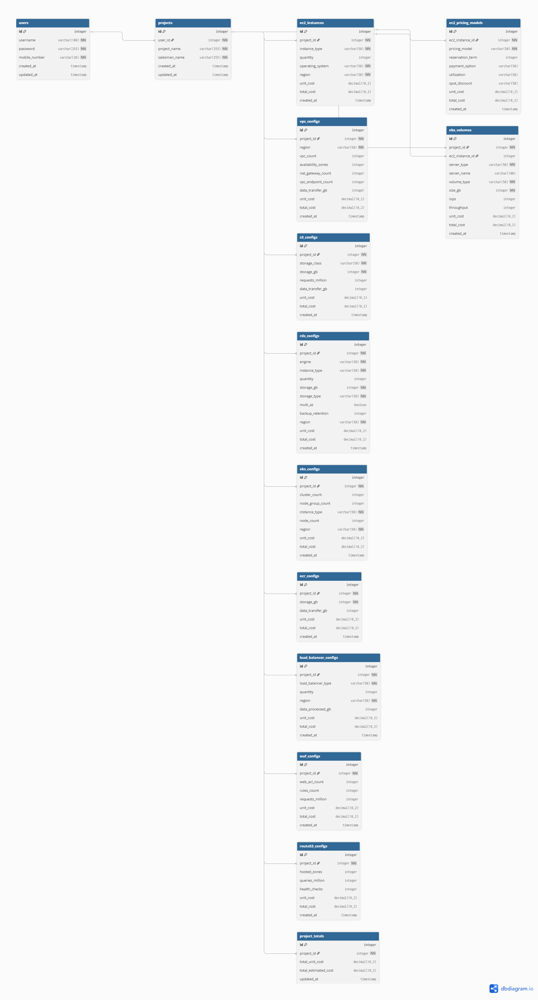

# Cloudly AWS Ask

A comprehensive AWS cost estimation and invoice generation system built with PHP, MySQL, HTML, CSS, and JavaScript. This enterprise-level application helps businesses calculate and manage AWS service costs with detailed breakdowns and professional PDF invoice generation.


Edit `config/database.php` to match your MySQL settings:

```php
$host = 'localhost';
$db = 'aws_calc';
$user = 'root';
$pass = '';
$port = '3307';
```
 
 
### Database Diagram (ERD)

- **Interactive diagram (dbdiagram.io):** https://dbdiagram.io/d/693f1655e877c63074c9ed19
- 
  

  
# To Do List
```Todo List:
Dockerized the project
Build pipelines
Set All Config and Deploy
```
